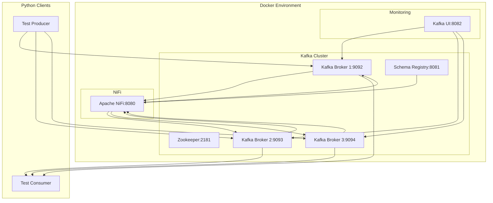

# Task Two - Kafka + Apache NiFi Integration (Docker)

Интеграция Apache Kafka с Apache NiFi через Docker Compose для Windows.

## 📋 Архитектура



## 🚀 Быстрый старт

### Требования
- **Windows 10/11** или **Linux**
- **Docker Desktop** (https://www.docker.com/products/docker-desktop)
- **Python 3.8+**
- **4GB+ свободной RAM**
- **10GB+ свободного места**

### 1. Запуск инфраструктуры

```bash
# Запуск всех сервисов
docker compose up -d

# Или на Windows
start.bat
```

### 2. Доступ к веб-интерфейсам

| Сервис | URL | Описание |
|--------|-----|----------|
| **Apache NiFi** | http://localhost:8080/nifi | Веб-интерфейс NiFi |
| **Kafka UI** | http://localhost:8082 | Мониторинг Kafka |
| **Schema Registry** | http://localhost:8081 | REST API схем |

**Данные для входа в NiFi:**
- Логин: `admin`
- Пароль: `ctsBtRBKHRAx69EqUghvvgEvjnaLjFEB`

### 3. Тестирование Python клиентов

```bash
# Установка зависимостей
cd python
pip install -r requirements.txt

# Запуск продюсера
python test_producer_confluent.py

# Запуск консьюмера
python test_consumer_confluent.py
```

## 📊 Конфигурация Kafka

### Кластер
- **3 Kafka брокера** (порты 9092, 9093, 9094)
- **Zookeeper** (порт 2181)
- **Replication Factor:** 3
- **Min ISR:** 2

### Топики
| Топик | Партиции | Репликация | Описание |
|-------|----------|------------|----------|
| `user-events` | 3 | 3 | Входящие события |
| `processed-events` | 3 | 3 | Обработанные события |
| `analytics-events` | 3 | 3 | Аналитические события |
| `purchase-events` | 3 | 3 | События покупок |
| `error-events` | 3 | 3 | Ошибки обработки |

### Параметры производительности
- **Compression:** snappy
- **Retention:** 7 дней
- **Segment size:** 1GB
- **Cleanup policy:** delete

## 🔧 Apache NiFi Flow

### Настройка Flow
1. Откройте http://localhost:8080/nifi
2. Войдите с данными `admin` / `ctsBtRBKHRAx69EqUghvvgEvjnaLjFEB`
3. Импортируйте template из `templates/kafka_integration_flow.xml`
4. Настройте процессоры для ваших задач

### Компоненты обработки
1. **ConsumeKafka** - чтение из `user-events`
2. **UpdateAttribute** - добавление метаданных
3. **LogAttribute** - логирование для мониторинга
4. **PublishKafka** - запись в `processed-events`

## 🧪 Тестирование и мониторинг

### Проверка топиков
```bash
docker exec kafka-broker-1 kafka-topics --list --bootstrap-server localhost:9092
```

### Отправка тестового сообщения
```bash
docker exec kafka-broker-1 kafka-console-producer --bootstrap-server localhost:9092 --topic user-events
```

### Чтение сообщений
```bash
docker exec kafka-broker-1 kafka-console-consumer --bootstrap-server localhost:9092 --topic processed-events --from-beginning
```

### Мониторинг
- **Kafka UI:** http://localhost:8082 - визуальный мониторинг
- **JMX порты:** 9991-9995 для метрик
- **Docker статистика:** `docker stats`

## 📁 Структура проекта

```
task_two/
├── docker-compose.yml      # Основная конфигурация Docker
├── start.bat              # Запуск инфраструктуры (Windows)
├── python/                # Python клиенты
│   ├── test_producer_confluent.py  # Продюсер
│   ├── test_consumer_confluent.py  # Консьюмер
│   └── requirements.txt   # Python зависимости
├── scripts/               # Утилиты и скрипты
├── templates/             # NiFi templates
│   └── kafka_integration_flow.xml
├── nifi-templates/        # Дополнительные NiFi шаблоны
└── image/                 # Изображения для документации
```

## ⚙️ Управление

### Основные команды
```bash
# Запуск всех сервисов
docker compose up -d

# Остановка без удаления данных
docker compose stop

# Полная остановка и удаление
docker compose down

# Просмотр логов
docker compose logs -f

# Перезапуск отдельного сервиса
docker compose restart apache-nifi
```

### Очистка данных
```bash
# Удаление всех данных и перезапуск
docker compose down -v
docker compose up -d
```

## 🔍 Отладка

### Проверка состояния контейнеров
```bash
docker compose ps
```

### Подключение к контейнеру
```bash
docker exec -it kafka-broker-1 bash
```

### Просмотр логов
```bash
docker compose logs apache-nifi
docker compose logs kafka-broker-1
```

## 📈 Производительность

### Мониторинг ресурсов
- **CPU:** Рекомендуется 4+ ядра
- **RAM:** Минимум 4GB, рекомендуется 8GB
- **Диск:** SSD для лучшей производительности

### Настройка JVM
Можно настроить в `docker-compose.yml`:
```yaml
environment:
  - KAFKA_HEAP_OPTS=-Xmx2g -Xms2g
```

## 🛠️ Расширение

### Добавление новых топиков
Добавьте в секцию `kafka-init` в `docker-compose.yml`:
```bash
kafka-topics --create --topic your-topic --partitions 3 --replication-factor 3 --bootstrap-server kafka-broker-1:9092
```

### Подключение внешних клиентов
Используйте порты:
- **Kafka:** 9092, 9093, 9094
- **Schema Registry:** 8081
- **Zookeeper:** 2181

## 🏁 Заключение

Проект предоставляет полную Docker среду для разработки и тестирования Kafka интеграций с Apache NiFi. Все компоненты настроены для работы "из коробки" и готовы к использованию. 